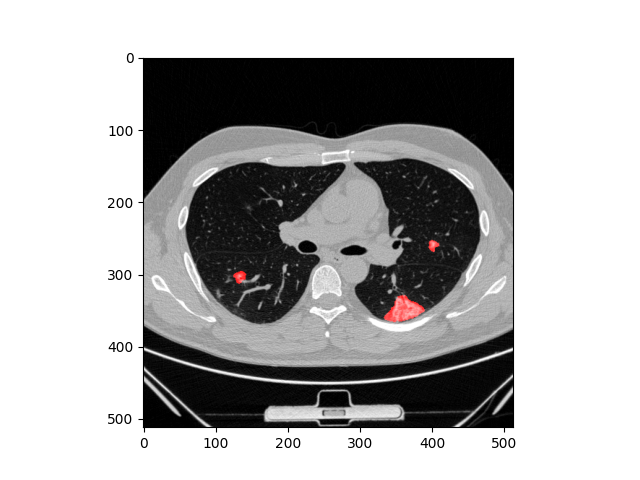
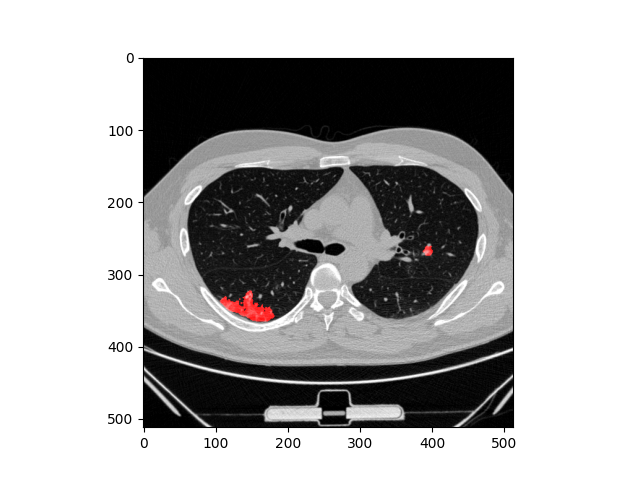
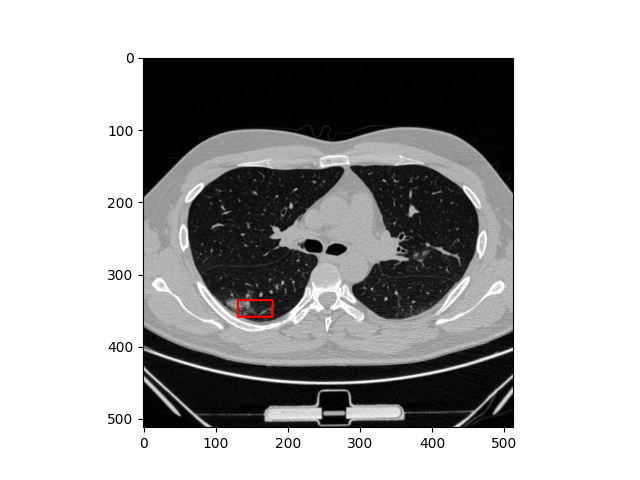
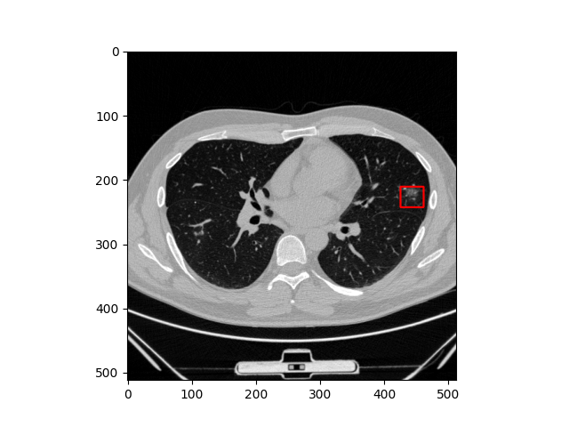

# Medical-NN-service
Service for detection and segmentation damage on lung from COVID-19
The repository does not contain model weights!
### Semantic segmentation
Model: U-Net with backbone DenseNet-121
#### Example



### Detection
Model: YOLOv3
#### Example




## Install dependencies

```bash
    pip install requirements.py
```

## Run service
```bash
    python -m src.service.app ARGS
```
ARGS:
1. --host (default: 0.0.0.0)
2. --path_to_log_dir (default: "logs/")
3. --time_to_shutdown_session (Time in seconds after how long the model will be unloaded from RAM if it is not accessed, default: 5 min)

The service runs on port 8080.